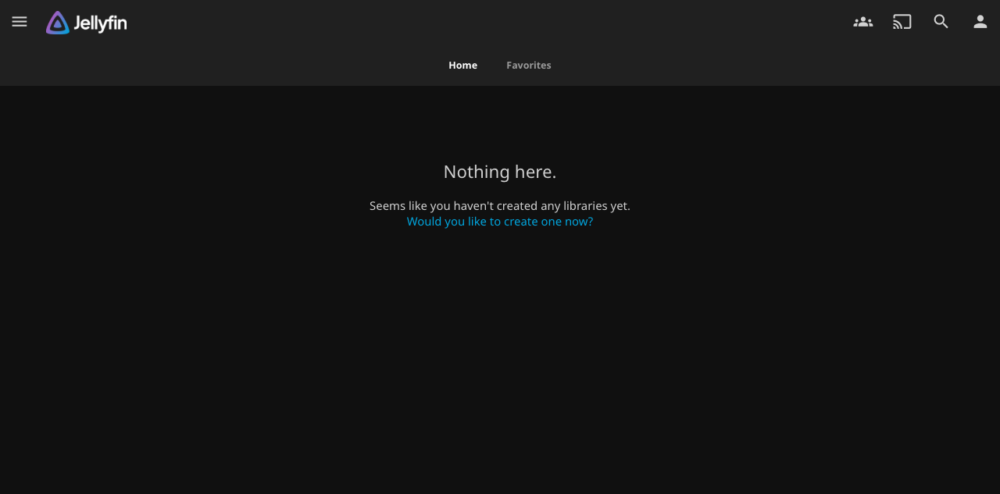

# 🎬 Jellyfin for Dogebox

**The Free Software Media System, packaged as a [Dogebox](https://dogebox.org) pup.**

Your movies, shows, music and photos — on your own Dogecoin node box. No accounts, no cloud, no subscriptions, no tracking.



## Install

In your Dogebox dashboard:

1. **Pup Store → Manage Sources → Add Source**, paste this repo's URL (the `.git` suffix is required by Dogebox):
   ```
   https://github.com/PennybagsCX/dogebox-jellyfin-pup.git
   ```
2. Install **Jellyfin** from the store. The first build takes a minute or two (nix pulls the binaries from cache).
3. Open the pup's management screen → **Launch web** — Dogebox maps the web UI to a host port (e.g. `http://dogebox:10003`). Point your TV/phone Jellyfin apps at that host + port.
4. Complete the setup wizard (create your admin account). Done.

> **Pup-source authors note:** the source validator requires **semver git tags** (`v0.0.2`, …) — a repo with only commits will fail to add with a cryptic 500.

## Where your media lives

Everything stays on the Dogebox data disk, inside the pup's storage volume:

```
/storage/config   # server config + metadata
/storage/cache    # transcode cache
/storage/log      # logs
/storage/media    # ← your library (make movies/, shows/, music/ subfolders)
```

Copy media in over SSH (path from the pup management screen):

```bash
scp -r ~/Movies/*.mkv shibe@dogebox:/opt/dogebox/pups/storage/<pup-id>/media/movies/
```

Then add the folder as a library in the Jellyfin dashboard.

## Hardware notes (NanoPC-T6 / RK3588)

- **Direct play** of 1080p/4K H.264/H.265 is effortless.
- CPU transcoding handles 1–2 concurrent 1080p streams; RK3588 VPU hardware transcode on mainline Linux is still maturing — don't buy this box *for* transcoding.
- 16 GB RAM means Jellyfin coexists happily with a full Dogecoin node (~4 GB).

## How it's built

One Nix expression (`jellyfin/pup.nix`): nixpkgs' `jellyfin` + a `run.sh` wrapper pointing config/cache/log/media at the pup storage volume. Manifest exposes HTTP 8096 with `webUI: true` + `listenOnHost: true`.

### Gotchas learned the hard way

- **Don't pass `--ffmpeg` to Jellyfin** — the nixpkgs wrapper already injects it, and Jellyfin exits with `Option 'ffmpeg' is defined multiple times` (fixed in v0.0.2).
- **Headless setup**: after a fresh start, the startup API needs ~60 s before it's ready. Then:
  ```
  POST /Startup/Configuration {"UICulture":"en-US","MetadataCountryCode":"US","PreferredMetadataLanguage":"en"}
  POST /Startup/User {"Name":"...","Password":"..."}   → 204
  POST /Startup/Complete
  ```

## Contributing

PRs welcome. Test on a real Dogebox before shipping a release — the ecosystem is young and every install is compiled on-box.

## License

MIT. Jellyfin is GPLv2 — this repo only packages it.
